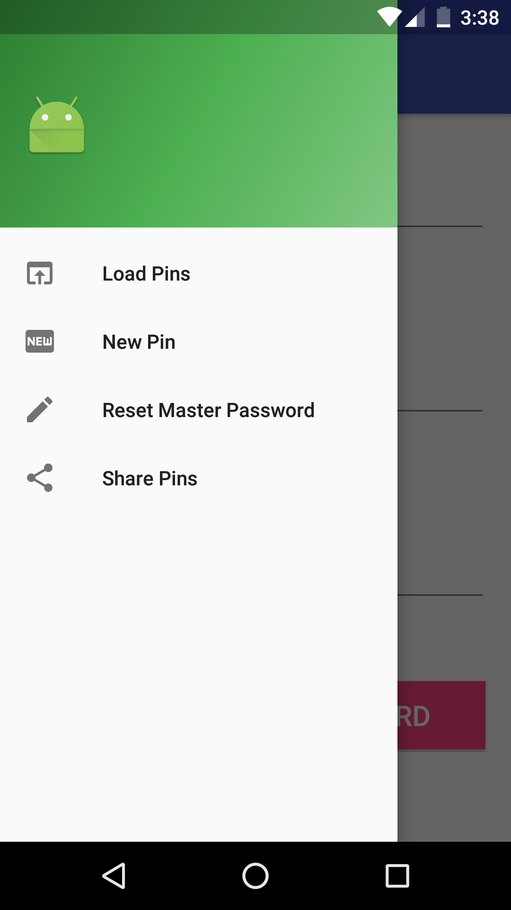
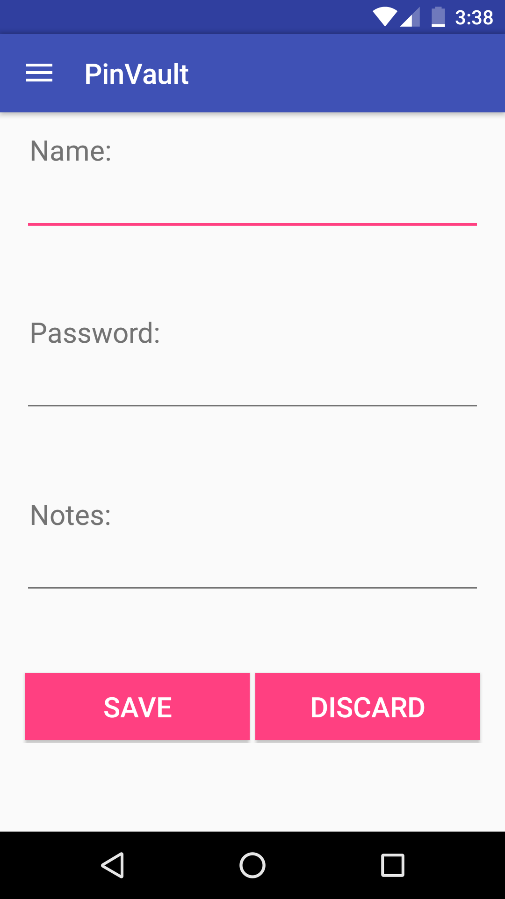

# PinVault App

This is an app that will be used to securely save pins/ passwords on an android device. It will us ethe Navigation Drawer for navigation purposes. And it will use SQlite for data persistence.

## Pin Model:
The Pin model will be made up of:
long _id, 
String label,
String pin, and
String notes.

## Pin Persistence:
The pins will persist on a Sqlite Database with the Schema representing the model.
The CRUD operations will be performed using the Helper Class.

## Pin Helper Class:
The following public methods are exposed from the Pin Helper Class:

1. long insertPin(Pin pin)
2. Pin getPin(long _id)
3. List<Pins> getPins(void)
4. boolean removePin(long _id)
5. boolean removeAll(void)

### Views:
1. New Pin: Used to add a new pin. Already implemented. Will let a user add a pin provided the label and the pin have been set at the very least. The note is optional. There will be an option to discard the pin if the pin doesn't need to be saved.

#### Screenshots:

